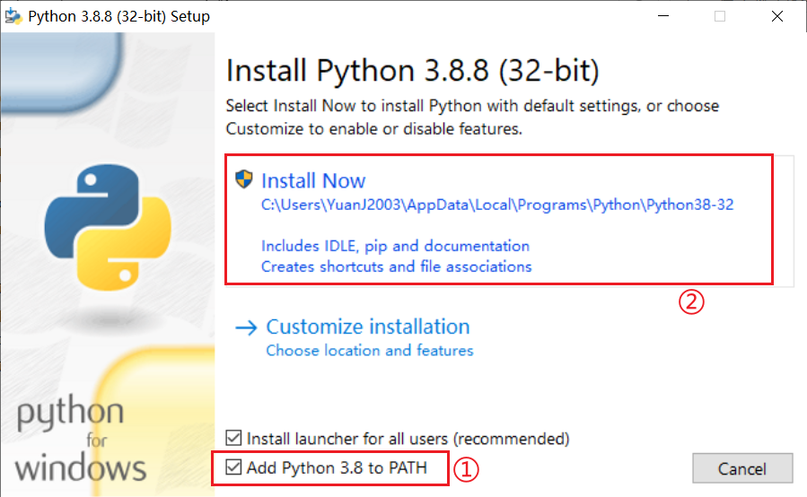

## Description

A Python exercise project for beginners.A simple rice ID conversion and sequence extraction tool.

## Usage

Before starting, you need to install Python first. Click [here](https://mirrors.huaweicloud.com/python/3.8.8/python-3.8.8.exe) to download Python 3.8 through Huawei Cloud Express. Please note that you need to check to add Python to the environment variable, and all other processes will default.

After installing Python, double-click to run the start.bat script to start using it., Alternatively, you can run main.py directly.

## Data sources

- [RAP-DB](https://rapdb.dna.affrc.go.jp/)
- [Ensembl](https://plants.ensembl.org/index.html)

## TODO

- Implement an interface oriented program.
- Integrate data and programs as a whole, while preserving other interfaces for importing data.